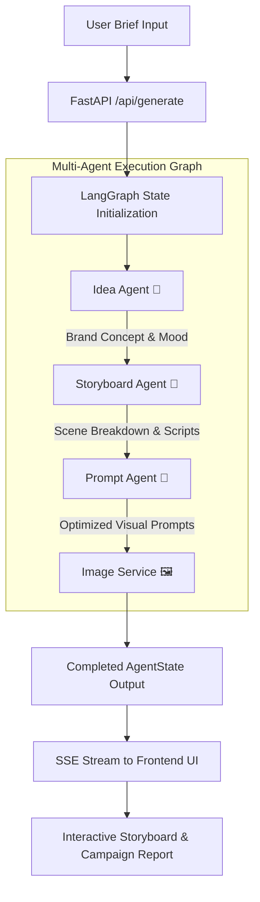

# 🎨 AI Creative Studio (FrameFlow AI)

<div align="center">


### **End-to-End Autonomous Multi-Agent Visual Campaign & Storyboard Generation Engine**

*Transform a simple text idea into a fully articulated visual campaign, scene-by-scene storyboard, optimized AI image prompts, and executive marketing report in under 60 seconds.*

[Key Features](#-key-features) • [Architecture](#-system-architecture) • [Getting Started](#-getting-started) • [API Reference](#-api-reference) • [Multi-Agent Pipeline](#-multi-agent-pipeline)

</div>

---

## 📌 Overview

In traditional advertising agencies and content creation studios, producing a comprehensive visual campaign requires hours of manual work:
1. 🧠 **Brainstorming Concept**: Formulating moodboards, brand voice, and visual direction (1-2 hours).
2. 📝 **Scene Scripting**: Breaking down the narrative into sequential visual scenes (1 hour).
3. 🎨 **Prompt Engineering**: Crafting and tweaking Midjourney / DALL-E prompts for each scene (1-2 hours).
4. 📊 **Client Pitching**: Assembling storyboards, export reports, and presentation decks (1 hour).

**AI Creative Studio** automates this entire 5-hour workflow into an **autonomous 1-minute multi-agent orchestration**. Driven by **LangGraph**, specialized AI agents collaborate sequentially to turn a prompt like *"Cyberpunk Coffee Brand Launch in Neo-Tokyo"* into production-ready visual campaign assets.

---

## ✨ Key Features

- **🧠 Autonomous Multi-Agent Orchestration (LangGraph)**:
  - **Idea Agent**: Formulates high-concept brand strategy, moodboard narratives, target audience analysis, brand voice, and color palettes.
  - **Storyboard Agent**: Deconstructs concepts into sequential cinematic scenes with specific camera angles, lighting cues, and narrative scripts.
  - **Prompt Agent**: Generates precision visual art prompts optimized for Midjourney v6, Flux Schnell, and DALL-E 3 (including negative prompts and aesthetic tags).
  - **Image Rendering Engine**: Renders high-resolution visual assets asynchronously for each scene.

- **⚡ Real-Time Server-Sent Events (SSE) Streaming**:
  - Live console output streaming step-by-step progress from the backend directly to the interactive frontend UI.

- **🎨 Futuristic UI/UX Design System**:
  - Cyberpunk-inspired dark glassmorphism theme built with vanilla CSS design tokens.
  - Interactive preset campaign cards (Cyberpunk Coffee, Luxury Watch, Eco Tech, Futuristic Hypercar).
  - Fullscreen lightbox image viewer with copyable AI prompt snippets.
  - Executive campaign report view with color palette swatches, format mockup previews (16:9, 9:16, 1:1), and one-click JSON/PDF export.

- **🛡️ Bulletproof Fallback Engine**:
  - Fully functional out-of-the-box! Runs seamlessly with or without external API keys using dynamic high-resolution visual engines.

---

## 🏗️ System Architecture

```text
ai-creative-studio/
├── 📂 backend/                  # Python 3.11 + FastAPI + LangGraph Backend
│   ├── 📂 app/
│   │   ├── 📂 agents/          # LangGraph Multi-Agent Workflows
│   │   │   ├── state.py        # Campaign AgentState TypedDict schema
│   │   │   ├── idea_agent.py   # Concept & Brand Strategy Agent
│   │   │   ├── storyboard_agent.py # Scene Breakdown & Scripting Agent
│   │   │   ├── prompt_agent.py # AI Prompt Engineering Agent
│   │   │   └── graph.py        # LangGraph Pipeline Construction
│   │   │
│   │   ├── 📂 services/        # Service Integrations & LLM Engines
│   │   │   ├── llm_service.py   # DeepSeek / Gemini / OpenAI LLM Handler
│   │   │   └── image_service.py # Replicate Flux & Dynamic Visual Asset Engine
│   │   │
│   │   ├── 📂 api/             # FastAPI REST & SSE Streaming Routes
│   │   │   └── routes.py       # POST /api/generate & GET /api/stream/{task_id}
│   │   │
│   │   └── main.py             # Server Application Entry Point
│   │
│   ├── .env.example            # Environment Key Template
│   ├── requirements.txt        # Python Dependencies
│   └── Dockerfile              # Production Docker Container Setup
│
├── 📂 frontend/                 # React 18 + Vite Frontend
│   ├── 📂 src/
│   │   ├── 📂 components/      # UI Components
│   │   │   ├── InputForm.jsx   # Brief Input & Preset Templates
│   │   │   ├── WorkflowProgress.jsx # Live Agent Console & Pipeline Visualizer
│   │   │   ├── StoryboardCard.jsx # Scene Cards & Lightbox Modal
│   │   │   └── ReportView.jsx   # Campaign Executive Summary & Mockups
│   │   │
│   │   ├── 📂 services/        # API Client & SSE Stream Listener
│   │   │   └── api.js
│   │   │
│   │   ├── App.jsx             # Main Application Logic
│   │   └── index.css           # Glassmorphism Design Tokens & Utilities
│   │
│   ├── package.json
│   └── vite.config.js
│
└── README.md                   # Detailed Documentation
```

---

## 🤖 Multi-Agent Pipeline Flowchart



---

## 🛠️ Tech Stack

### **Backend Frameworks & Libraries**
- **Language**: Python 3.11+
- **Agent Framework**: LangGraph (StateGraph Orchestration)
- **Web Framework**: FastAPI (Async Uvicorn ASGI Server)
- **LLM Integrations**: DeepSeek, Google Gemini 1.5/2.0, OpenAI GPT-4o
- **Image Generators**: Replicate (Flux Schnell) & Dynamic Asset Engine
- **Data Validation**: Pydantic v2 & TypedDict State Management

### **Frontend Frameworks & Libraries**
- **Framework**: React 18
- **Build Tool**: Vite 5
- **Icons**: Lucide React
- **Styling**: Vanilla CSS (Custom Design System with Glassmorphic Blur & Glow Tokens)

---

## 🚀 Getting Started

### Prerequisites
- **Python**: `3.11` or higher
- **Node.js**: `18.0` or higher
- **npm**: `9.0` or higher

---

### 1. Backend Setup

1. **Navigate to the backend directory**:
   ```bash
   cd backend
   ```

2. **Create and activate a virtual environment**:
   - **Windows (PowerShell)**:
     ```powershell
     python -m venv venv
     .\venv\Scripts\activate
     ```
   - **macOS / Linux**:
     ```bash
     python3 -m venv venv
     source venv/bin/activate
     ```

3. **Install Python dependencies**:
   ```bash
   pip install -r requirements.txt
   ```

4. **Configure Environment Variables**:
   Copy `.env.example` to `.env`:
   ```bash
   cp .env.example .env
   ```
   *(Optional) Fill in your API keys in `.env`:*
   ```env
   DEEPSEEK_API_KEY=your_deepseek_api_key
   GEMINI_API_KEY=your_gemini_api_key
   OPENAI_API_KEY=your_openai_api_key
   REPLICATE_API_KEY=your_replicate_api_key
   ```

5. **Start the FastAPI backend server**:
   ```bash
   python -c "import sys, uvicorn; sys.path.insert(0, '.'); from app.main import app; uvicorn.run(app, host='0.0.0.0', port=8000)"
   ```
   *The server will start at `http://localhost:8000`. API Swagger Docs: `http://localhost:8000/docs`*

---

### 2. Frontend Setup

1. **Open a new terminal and navigate to the frontend directory**:
   ```bash
   cd frontend
   ```

2. **Install Node modules**:
   ```bash
   npm install
   ```

3. **Launch Vite Development Server**:
   ```bash
   npm run dev
   ```
   *The Web UI will be accessible at `http://localhost:5173/`*

---

## 📡 API Reference

### `POST /api/generate`
Initiates an asynchronous multi-agent campaign generation workflow.

**Request Body**:
```json
{
  "user_prompt": "Cyberpunk high-caffeine quantum roasted coffee launch in Neo-Tokyo",
  "style": "Cyberpunk",
  "num_scenes": 4
}
```

**Response**:
```json
{
  "task_id": "2be98154-0244-44d0-864a-cfc309e53e16",
  "status": "queued",
  "message": "Campaign workflow initiated successfully."
}
```

---

### `GET /api/stream/{task_id}`
Establishes a Server-Sent Events (SSE) stream returning real-time execution logs and updated state objects.

**Stream Payload Example**:
```json
{
  "status": "processing",
  "current_step": "storyboard_creation",
  "new_logs": [
    "📝 [Storyboard Agent]: Breaking down campaign concept into 4 sequential scenes..."
  ],
  "concept": {
    "title": "NEO-BREW 2088: Cyberpunk Coffee Launch",
    "tagline": "Awaken Your Cybernetic Soul",
    "mood": "Neon-drenched synthwave, rainy asphalt"
  }
}
```

---

## 🐳 Docker Deployment

You can build and run the entire backend service in a Docker container:

```bash
cd backend
docker build -t ai-creative-studio-backend .
docker run -d -p 8000:8000 --env-file .env ai-creative-studio-backend
```

---

## 📄 License

This project is open-source and released under the **[MIT License](LICENSE)**.

---

<div align="center">
  <sub>Built with ❤️ by Antigravity Engineering • FrameFlow AI Architecture</sub>
</div>
